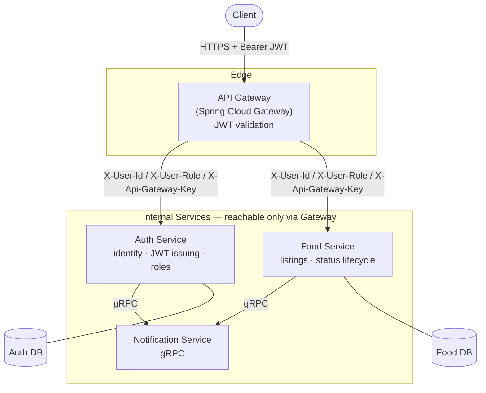

# Food Surplus Distribution Platform

A microservices backend that connects food donors (restaurants, event organizers, households) with people and organizations who can collect surplus food before it goes to waste.

## Architecture



- **API Gateway** is the single entry point to the system. It validates every incoming JWT, extracts `user_id` and `role` from the token claims, and forwards them downstream as `X-User-Id` / `X-User-Role` headers — internal services never re-parse the token themselves.
- **Service-to-service trust**: every request the gateway forwards carries a shared `X-Api-Gateway-Key` header. Downstream services reject any request that doesn't carry it, so they're only reachable through the gateway, never directly.
- **Auth Service** owns identity: registration, login, role-based authorization, JWT issuing/validation, BCrypt password hashing.
- **Food Service** owns food listings: creation, browsing, per-listing detail, updates, deletion, and status transitions (available → reserved → completed/expired/cancelled) with transition rules enforced server-side.
- **Notification Service** is called over gRPC to notify users of relevant events (e.g. listing status changes).

## Tech stack

- **Language/Framework**: Java 21, Spring Boot, Spring Security, Spring Data JPA
- **Gateway**: Spring Cloud Gateway (reactive/WebFlux)
- **Auth**: JWT (jjwt), BCrypt
- **Inter-service messaging**: gRPC / Protocol Buffers
- **Persistence**: PostgreSQL / MySQL
- **Build**: Maven

## Services

### API Gateway (`api_gateway/`)
Routes `/api/auth/**` and `/api/food/**` to their respective services. Validates JWTs on every request except login/register, and injects `X-User-Id`, `X-User-Role`, and `X-Api-Gateway-Key` before forwarding downstream.

### Auth Service (`securityBackend/`)
- `POST /api/auth/userRegister` — create account
- `POST /api/auth/userLogin` — authenticate, issue JWT
- `GET /api/auth/GetUsers` — admin-only user listing
- `PUT /api/auth/userUpdate/{id}` — update profile
- `DELETE /api/auth/userDelete/{id}` — remove account

### Food Service (`Food_service/`)
- `POST /api/food/createFood` — create a food listing (title, description, food type, quantity, cooked/expiry time, pickup address, geolocation, images)
- `GET /api/food/getFoodList` — browse available listings
- `GET /api/food/getFood/{id}` — get a single listing's details
- `PATCH /api/food/UpdateFood/{id}` — update listing fields
- `PATCH /api/food/{id}/status` — transition a listing's status (with validated state transitions)
- `DELETE /api/food/deleteFood/{id}` — remove a listing

### Notification Service (`notification_service/`)
Exposes a gRPC endpoint (`sendNotification`) that other services call to notify users of relevant events.

## Running locally

Each service reads its DB and secrets from environment variables:

```
JWT_SECRET=<shared HMAC secret>
API_GATE_WAY_KEY=<shared gateway key>
```

1. Start Auth Service on `:8081`
2. Start Food Service on `:8082`
3. Start Notification Service (gRPC)
4. Start API Gateway on `:8080` — this is the entry point clients talk to

## Why this project

Built to work through the real friction of a multi-service system: how you handle identity across service boundaries, keep internal services unreachable from outside the gateway, coordinate state transitions on a shared resource, and let services notify each other asynchronously via gRPC without every one of them duplicating auth logic.